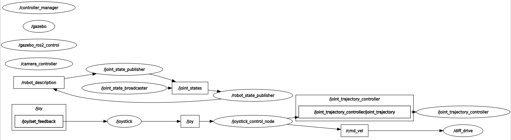

# endoscope_project

### Progess

#### References
[:link:](https://with-rl.tistory.com/entry/URDF%EB%A5%BC-%EC%9D%B4%EC%9A%A9%ED%95%9C-%EA%B0%84%EB%8B%A8%ED%95%9C-%EB%A1%9C%EB%B4%87-%EB%A7%8C%EB%93%A4%EA%B8%B0-3)
[:link:](https://davidvalenciaredro.wixsite.com/my-site/services-7)
[:link:](https://github.com/dvalenciar/robotic_arm_environment)
[:link:](https://github.com/ros-controls/gazebo_ros2_control/)
[:link:](https://github.com/ros-controls/ros2_controllers)
[:link:](https://robotics.snowcron.com/robotics_ros2/dif_drive_xacro.htm)
[:link:](https://robotics.snowcron.com/robotics_ros2/dif_drive_links.htm)